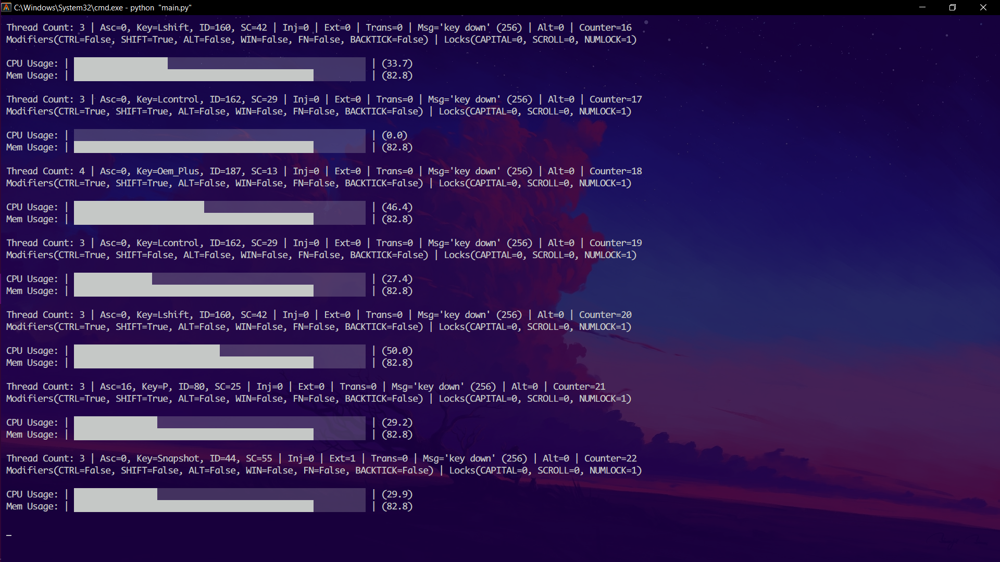

# Macropy
Keyboard listener, hotkey manager, word expander, task automation, and more!

## Big Update - Cython
Cython is used to compile python source code and make it faster. Cython creates `.c` files that can be compiled into python binary extension modules.

The `macropy/cython_extensions` directory contains all the cython code for all the script module. For each module, there are two files:
- `xxx.pyx`: Python source code written in Cython, which can later be compiled into a `.c` file.
- `xxx.c`: The compiled version of the cython extension module, which can later be compiled into `.pyd` binary source files.

The actual files that are imported and used are the `.pyd` files. I have uploaded the `.c` files that were generated with Cython, so it is not necessary to have Cython to recompile the existing extension modules. To build the Cython extensions, run:

    python setup.py build_ext --inplace

By default, `setup.py` builds the extension from the `.pyx` files and falls back to the `.c` files if Cython is not installed. If you wish to build using the `.c` files (for example, to ensure that the build doesn't fail due to particular Cython version issues), you must set `USE_CYTHON=False` in `setup.py`.

To use this script, you can pip install it as follows:

    pip install kb_macropy

Note that the package name for download is kb_macropy. However, to start the script, run `macropy`.

You can also clone this repository and simply run the `__main__.py` file, or install it by running:

    python setup.py install

## Why did I write this script?
A lot of times I found myself repeating one or more tasks. Some of these tasks are tedious and may be performed more than one time a day. Other tasks may be faster if they are performed without interacting with GUI elements. Combine all this with my low-performance laptop and you can see why I have written this script.

## Description
This script can be described as a keyboard listener. However, unlike normal keyboard listeners provided by existing modules like `keyboard`, `pynput`, etc., this script has two huge advantages. The first is the ability to use any key combination for triggering a hotkey, and multiple key combinations can be specified easily to trigger the same hotkey. The second advantage is the ability to use any keyboard keys (even keys like `FN`) as long as the key is reported by the os.

This script relies heavily on windows API and focuses on tasks that involve windows explorer. These tasks are triggered by a hotkey. There is also support for word expansion where you type a colon followed by an abbreviation, and a substitution will be added accordingly.

## Features
<ins>Below are some of the windows explorer operations that the script can perform</ins>:
- Creating a new file -> `Ctrl + Shift + ['m' or 'M']`.

- Copying the full path to the selected files in the active explorer/desktop window -> `Shift + F2`.

- Merging the selected images from the active explorer window into a PDF file -> `Ctrl + Shift + ['p' or 'P']`.

- Converting the selected word files from the active explorer window into PDF files -> `Backtick + ['o' or 'O']`.

- Converting the selected powerpoint files from the active explorer window into PDF files -> `Backtick + ['p' or 'P']`.

- Reopening closed file explorer windows (currently only keeps track of closed explorers by `Alt + F4` or `Ctrl + W`).

- Converting `.mp3` audio files into `.wav` files.

- Flattening directories by moving all the files/folders inside to the same level.

<ins>Next are some of the supported window manipulation operations</ins>:
- Moving the window around (up, right, down, right) -> `Backtick + (↑ or → or ↓ or ←)`.

- Making the window always on top -> `FN + Ctrl + ['a', 'A']`.

- Decreasing/increasing the opacity of a window -> `Backtick + (['+', '='] or ['-', '_'])`.

<ins>Next are some of the supported system manipulation operations</ins>:
- Putting the device into sleep mode -> `Win + FN + Ctrl + ['s', 'S']`.

- Shutting down the system -> `Win + FN + Ctrl + ['q', 'Q']`.

- Increasing/Decreasing the system volume -> `Ctrl + Shift + (['=', '+'] Or  ['-', '_'])`.

- Increasing/Decreasing brightness -> `Backtick + ('F2' Or  'F3')`.

- Sending hotkeys and keyboard key sequences.

- Scrolling up/down (by sending mouse wheel scrolls) -> While ScrLck is active: `W or A or S or D`.

<ins>Next are some of the supported text expansion operations</ins>:
- Expanding text (e.g., try pressing the next keys -> `:name`).

- Opening a file or a folder (e.g., try pressing the next keys -> `!paint`).

## Extra
- The script does not receive keyboard events when the active process is elevated. A notification message will be printed every 10 seconds with a sound when this happens. You can run the script with elevated privileges to receive keyboard events in this scenario.

- To terminate the script, press the hotkey -> `FN + ESC`.

- To make sure the script is running (by displaying a toast notification), press the hotkey -> `FN + /`.

- To clear the terminal, press the hotkey -> `Ctrl + FN + C`.

- To suppress/silence the terminal output, press the hotkey -> `FN + Alt + S`.

- To suppress keyboard keys (hotkeys still works), press the hotkey -> `Ctrl + Alt + D`.

- The script will not allow more than one active instance at a time.
